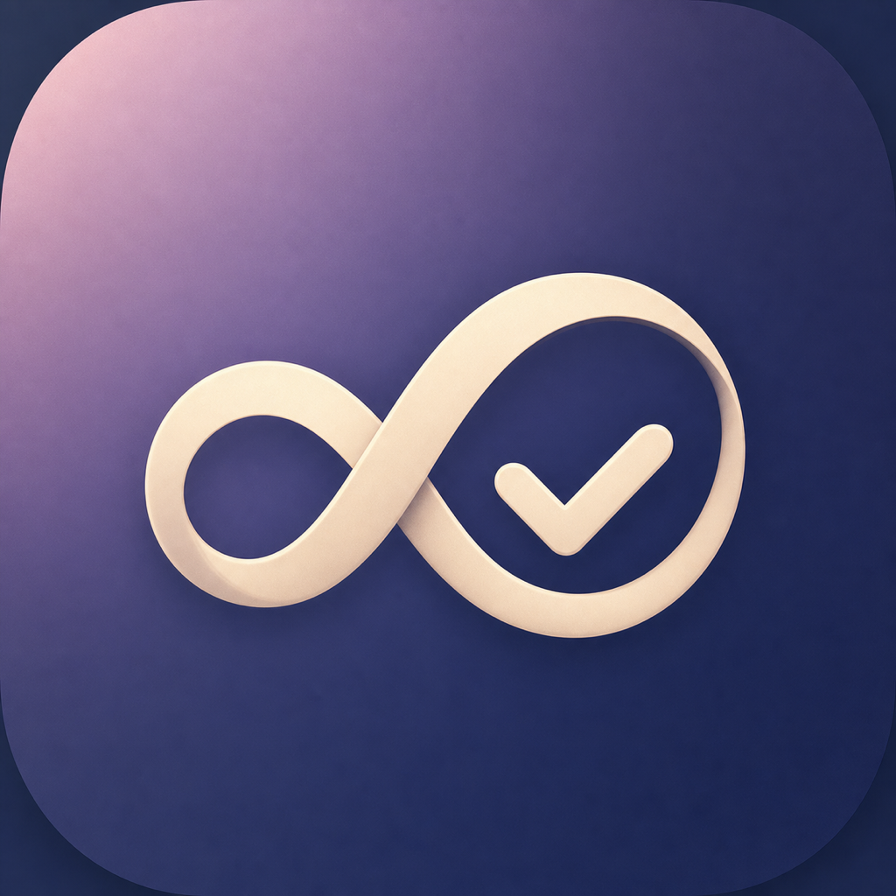
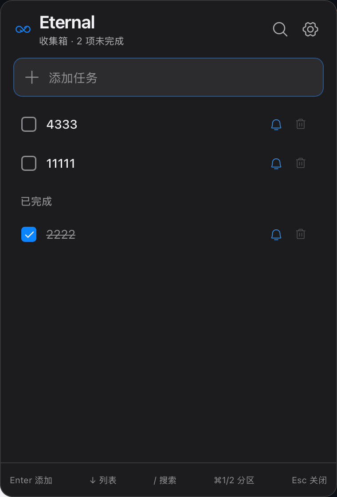
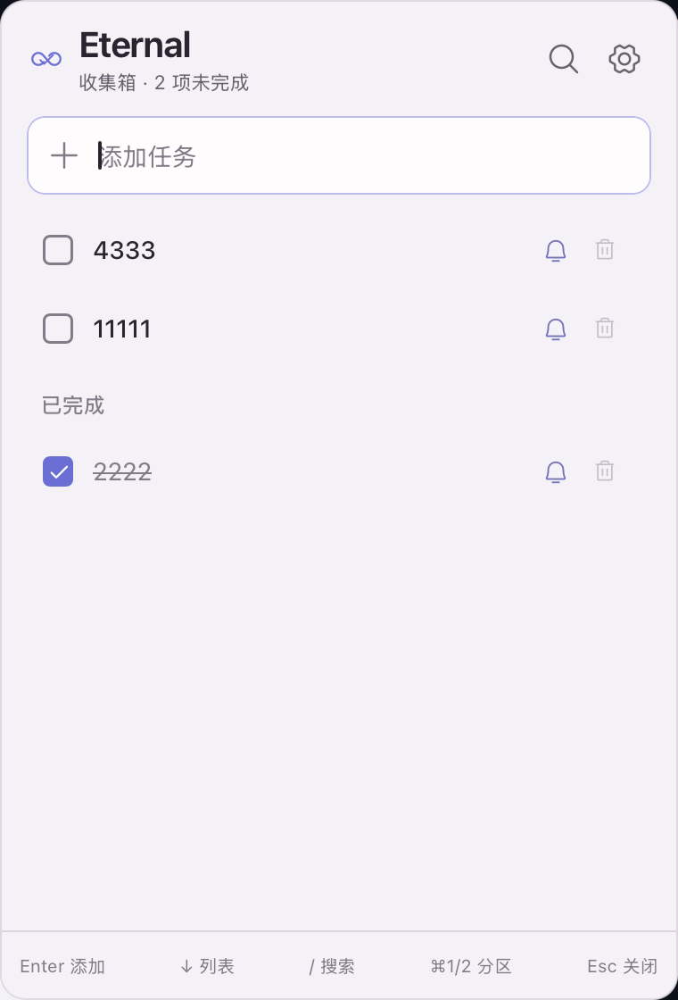

<p align="center">
  
</p>

<h1 align="center">Eternal</h1>

<p align="center">
  A local-first, keyboard-first lightweight todo and reminder app<br>
  Lives in the Windows tray / macOS menu bar — show it, use it, hide it
</p>

<p align="center">
  <strong>v0.2.3</strong>
  ·
  <a href="https://github.com/zhaogewudi666/Eternal/releases/latest">Latest release</a>
</p>

<p align="center">
  <a href="README.md">简体中文</a> | <strong>English</strong>
</p>

---

## Screenshots

<p align="center">
  
  &nbsp;&nbsp;
  
</p>

<p align="center">
  <sub>Dark mode · Light mode</sub>
</p>

---

## Download

| Platform | Architecture | Package |
|----------|--------------|---------|
| Windows 10/11 | x64 | [Eternal-0.2.3-Windows-x64-Setup.exe](https://github.com/zhaogewudi666/Eternal/releases/latest/download/Eternal-0.2.3-Windows-x64-Setup.exe) |
| macOS | Apple Silicon (arm64) | [Eternal-0.2.3-macOS-arm64.dmg](https://github.com/zhaogewudi666/Eternal/releases/latest/download/Eternal-0.2.3-macOS-arm64.dmg) |

Only these two targets are provided. There is no Intel Mac build and no universal package.

### Install notes (signing)

- **Windows**: The installer is **not code-signed**. If SmartScreen shows “Windows protected your PC”, confirm the source, then choose **More info** → **Run anyway**. Installs for the current user; administrator rights are usually not required.
- **macOS**: **Ad-hoc signed only** (no Apple Developer ID signature and not notarized). If Gatekeeper blocks the first launch, **Control-click → Open**, or allow it under **System Settings → Privacy & Security**. Apple Silicon (M-series) Macs only.

### Upgrades and data safety

- **Quit the old app before upgrading**. On macOS, open the new DMG, drag Eternal to Applications, and confirm replacement; on Windows, run the new installer over the existing per-user installation.
- **Do not uninstall and delete the app-data directory first**. Program files are separate from task data; replacing the app package does not delete existing tasks, settings, or password-vault data.
- Before a version upgrade, Eternal copies `tasks.json` into the app-data `backups/` directory and leaves the source in place. If a snapshot cannot be created, snapshots conflict, or the data format is newer, the app enters write-blocked mode instead of overwriting the original data with an empty list.
- There is currently no automatic updater. Install new packages manually, and keep the old version closed so two versions never write the same data at once.

---

## What it does

Eternal is a small, steady desktop todo panel: open it with a global hotkey, capture, search, complete, and set reminders entirely from the keyboard, then press `Esc` to dismiss and return focus to the window you were using.

- **Capture and search**: Type in the same panel to add a task; `/` enters search across open and completed items
- **Complete and restore**: `Space` completes or restores; completed tasks appear below the open list
- **Reminders**: Set time and recurrence on the selected task; system notifications fire when due
- **Safe delete**: `Backspace` / `Delete` asks for confirmation before deleting
- **Appearance**: Light / dark / follow system
- **Global hotkey**: Remappable in settings (defaults `⌘⇧Space` / `Ctrl+Shift+Space`)
- **Launch at login**: Optional “Start Eternal at login”; on auto-start it stays quiet in the tray/menu bar without stealing focus
- **Background presence**: macOS menu bar, Windows system tray; remembers last window position
- **Local data**: Tasks and settings stay on your machine — no accounts, no cloud sync, no telemetry

---

## Keyboard flow

| Action | Keys |
|--------|------|
| Show / hide panel | Configured global hotkey |
| Printable character | Focus capture or search and type |
| Search | `/` |
| Move up / down in the list | `↑` / `↓` |
| Complete / restore | `Space` |
| Reminder (when a task is selected) | `Enter` |
| Safe delete | `Backspace` / `Delete` (deletes after confirm) |
| Close panel and restore previous focus | `Esc` |

List navigation does not wrap: pressing `↑` on the first row returns focus to the capture or search field.

---

## Build from source

The app lives under `app/` (Vite + React frontend, Tauri 2 / Rust desktop shell).

**Requirements**: Node.js, npm, Rust (with `cargo`). Desktop packages also need local Tauri dependencies (see [Tauri prerequisites](https://v2.tauri.app/start/prerequisites/)).

```bash
cd app
npm ci
npm run test:run
npm run build
npm run test:sites
npm run tauri -- build
```

- `npm run test:run`: frontend Vitest
- `npm run build`: frontend build and Sites-related artifacts
- `npm run test:sites`: Sites worker tests
- `npm run tauri -- build`: produce desktop installers

Dev preview:

```bash
cd app
npm run tauri -- dev
```

---

## Repository layout (brief)

```
app/                 # Desktop app (frontend + src-tauri)
artifacts/qa/        # QA UI screenshots
artifacts/readme/    # README screenshots
design/              # Design references and icon sources
releases/            # Local release packages and checksums
```

---

## License

Eternal is licensed under [0BSD](LICENSE). You may use, copy, modify, and distribute this software for any purpose, including commercial use, with **no attribution required**, subject to the warranty disclaimer in [LICENSE](LICENSE).

---

<p align="center">
  <sub>Eternal · Todos should feel as light as breathing</sub>
</p>
