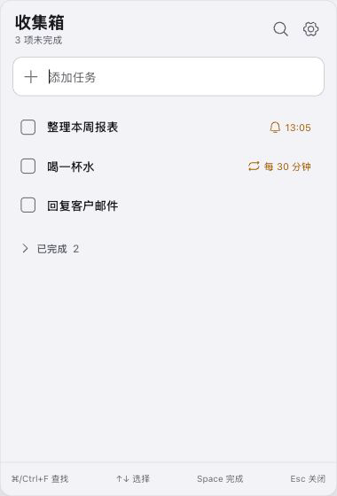

<p align="center">
  
</p>

<h1 align="center">Eternal</h1>

<p align="center">
  本地优先、键盘优先的轻量待办与提醒<br>
  Windows 托盘 / macOS 菜单栏常驻，用完即隐，不打扰
</p>

<p align="center">
  <strong>v0.2.3</strong>
  ·
  <a href="https://github.com/zhaogewudi666/Eternal/releases/latest">最新发布</a>
</p>

---

## 截图

<p align="center">
  
  &nbsp;&nbsp;
  
</p>

<p align="center">
  <sub>深色任务面板 · 浅色设置（外观 / 全局快捷键 / 开机启动）</sub>
</p>

---

## 下载

| 平台 | 架构 | 安装包 |
|------|------|--------|
| Windows 10/11 | x64 | [Eternal-0.2.3-Windows-x64-Setup.exe](https://github.com/zhaogewudi666/Eternal/releases/latest/download/Eternal-0.2.3-Windows-x64-Setup.exe) |
| macOS | Apple Silicon (arm64) | [Eternal-0.2.3-macOS-arm64.dmg](https://github.com/zhaogewudi666/Eternal/releases/latest/download/Eternal-0.2.3-macOS-arm64.dmg) |

当前仅提供上述两个目标；不含 Intel Mac，也不是 universal 包。

### 安装提示（签名说明）

- **Windows**：安装包**未做代码签名**。若 SmartScreen 提示「Windows 已保护你的电脑」，确认来源后可点「更多信息」→「仍要运行」。安装为当前用户，一般无需管理员权限。
- **macOS**：仅 **ad-hoc 签名**（无 Apple Developer ID 签名，也未公证）。首次打开若被拦截，可对应用**右键 → 打开**，或在「系统设置 → 隐私与安全性」中选择仍要打开。仅适用于 Apple Silicon（M 系列）Mac。

---

## 它做什么

Eternal 是一个小而稳的桌面待办面板：全局快捷键唤出，键盘完成捕获、搜索、完成与提醒，再 `Esc` 收起并回到你刚才的工作窗口。

- **捕获与搜索**：同一面板输入即添加；`/` 进入搜索，覆盖未完成与已完成
- **完成与恢复**：`Space` 完成或恢复；已完成任务列在未完成列表下方
- **提醒**：对选中任务设置时间与重复，系统通知到期提醒
- **安全删除**：`Backspace` / `Delete` 先确认，再删除
- **外观**：浅色 / 深色 / 跟随系统
- **全局快捷键**：可在设置中改绑（默认 `⌘⇧Space` / `Ctrl+Shift+Space`）
- **开机启动**：可选「开机时启动 Eternal」；自启时静默驻留托盘/菜单栏，不抢焦点
- **后台常驻**：macOS 菜单栏、Windows 系统托盘；记住上次窗口位置
- **数据本地**：任务与设置保存在本机，无账号、无云同步、无遥测

---

## 键盘流

| 操作 | 按键 |
|------|------|
| 打开 / 收起面板 | 已配置的全局快捷键 |
| 可打印字符 | 回到捕获或搜索并输入 |
| 搜索 | `/` |
| 在列表中上下移动 | `↑` / `↓` |
| 完成 / 恢复 | `Space` |
| 提醒（选中任务时） | `Enter` |
| 安全删除 | `Backspace` / `Delete`（确认后删除） |
| 关闭面板并恢复先前焦点 | `Esc` |

列表导航不环绕：在首行再按 `↑` 回到捕获或搜索输入框。

---

## 从源码构建

应用本体在 `app/`（Vite + React 前端，Tauri 2 / Rust 桌面壳）。

**环境**：Node.js、npm、Rust（含 `cargo`）；打桌面包还需本机 Tauri 依赖（见 [Tauri 前置条件](https://v2.tauri.app/start/prerequisites/)）。

```bash
cd app
npm ci
npm run test:run
npm run build
npm run test:sites
npm run tauri -- build
```

- `npm run test:run`：前端 Vitest
- `npm run build`：前端构建，并准备 Sites 相关产物
- `npm run test:sites`：Sites worker 测试
- `npm run tauri -- build`：生成桌面安装包

开发预览：

```bash
cd app
npm run tauri -- dev
```

---

## 仓库结构（简要）

```
app/                 # 桌面应用（前端 + src-tauri）
artifacts/qa/        # 界面截图
design/              # 设计参考与图标源稿
releases/            # 本地发布安装包与校验文件
```

---

<p align="center">
  <sub>Eternal · 待办应像呼吸一样轻</sub>
</p>
